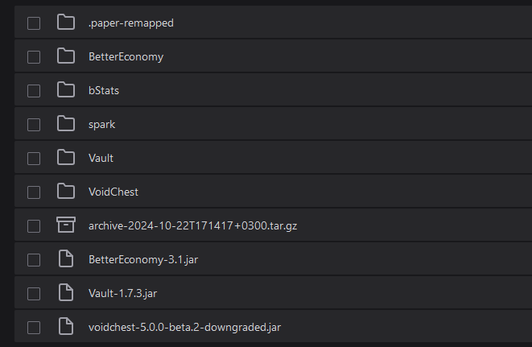

# Quickstart

## Overview

Installing **VoidChest** is straightforward and similar to installing any other Minecraft plugin. Follow these steps to get started:

### Step-by-Step Installation

1. **Download the Plugin:**
   * Obtain the latest version of the VoidChest plugin from [BuiltByBit](https://builtbybit.com/resources/voidchest-auto-sell-chunk-collector.10148/)
2. **Download Dependencies:**
   * Ensure you have the necessary dependencies, such as an Economy plugin (e.g., Vault, TheNewEconomy, or any other supported or custom one).
3. **Move the Plugin to the Plugins Folder:**
   * Place the downloaded VoidChest plugin JAR file into your Minecraft server's `plugins` directory.
4. **Start the Server:**
   * Start or restart your Minecraft server to load the plugin.
5. **Verify Installation:**
   * Check the server console for any errors or messages related to VoidChest. Ensure that the plugin has been successfully loaded.

### Required Dependencies

* **Economy Plugin:** VoidChest requires an Economy plugin to handle payouts, charges, and upgrades. Supported plugins include:
  * Vault
  * TheNewEconomy
  * Any other supported or custom Economy plugin

### Default Profit Calculator

* The default profit calculator for VoidChest is `VoidChest`. More detailed information on configuring profit calculators and other settings can be found in the Configuration section.

### Example Image

<figure><figcaption></figcaption></figure>

***

With VoidChest successfully installed, you can now configure the plugin to suit your server's specific needs. Refer to the Configuration section for detailed instructions on customizing VoidChest.
